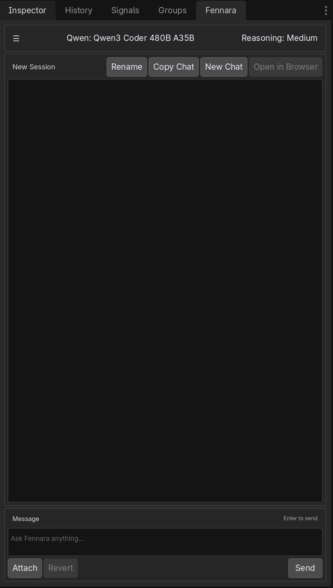
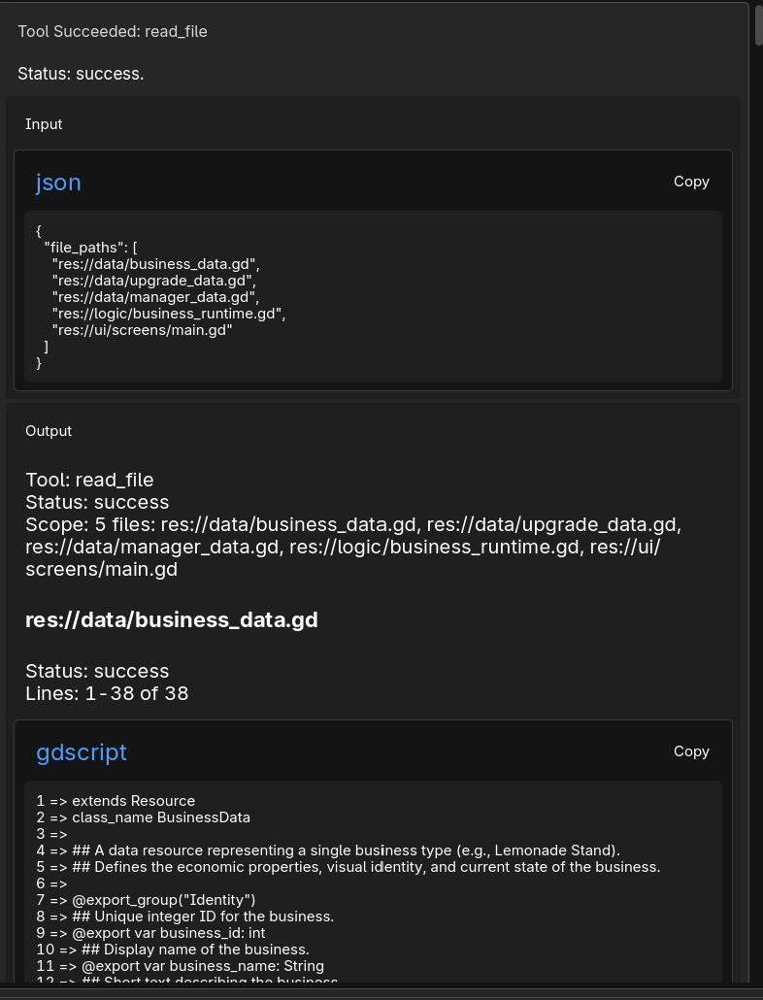
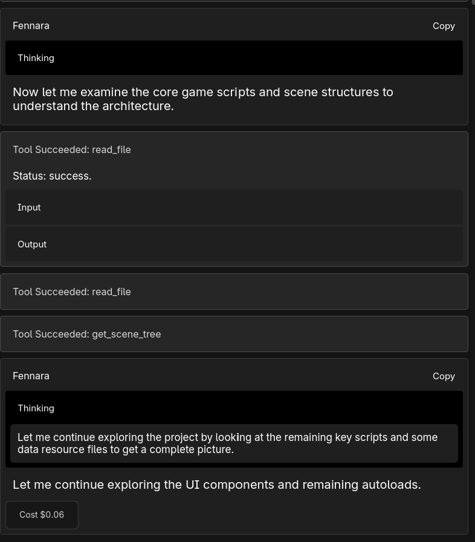

# Fennara Godot MCP

Fennara is a Godot MCP and AI plugin workflow for agents working inside real Godot projects.

Traditional MCP gives an AI commands.

Fennara gives the AI feedback from Godot:

- GDScript diagnostics
- scene validation
- runtime errors
- scene tree inspection
- node properties
- screenshots
- SemanticSearch
- patch-and-rerun workflows

Fennara is not trying to make Godot optional. It makes AI agents accountable to the real Godot engine.



## Why This Exists

Most Godot MCP servers expose editor commands like create node, set property, save scene, run project, read logs, and take screenshots.

That is useful, but it is not enough for real projects.

An AI agent can call commands successfully and still leave behind broken scripts, invalid scenes, missing resources, bad NodePaths, or runtime errors. Fennara is built around the feedback loop after the command: inspect, edit, receive Godot feedback, patch, and rerun.

## Demo

Watch Fennara MCP with Codex on GDQuest's open-source Godot 4 Open RPG project:

[](https://www.youtube.com/watch?v=0Egu3S-9MM0)

In the demo, Codex works on an existing RPG codebase instead of an empty project. The first script breaks, Fennara returns Godot feedback, and Codex patches the implementation.

Demo notes:

- [Open RPG demo breakdown](docs/open-rpg-demo.md)
- [Fennara vs traditional Godot MCP](docs/fennara-vs-traditional-godot-mcp.md)

## Links

- Godot MCP overview: https://www.fennara.io/godot-mcp
- Godot AI plugin overview: https://www.fennara.io/godot-ai-plugin
- Setup guide: https://www.fennara.io/docs/get-started
- MCP docs: https://www.fennara.io/docs/mcp
- Godot tools docs: https://www.fennara.io/docs/godot-plugin/tools
- Website: https://www.fennara.io

## Included Addon Preview

This repository includes the current Windows Godot addon payload under:

```text
addons/fennara
```

The included binary payload is intended as a public preview/reference package. For normal installation and account setup, use the Fennara dashboard installer from the setup guide:

https://www.fennara.io/docs/get-started

The installer handles the local device identity, Godot project selection, API key flow, plugin install, local MCP server install, and supported MCP app configuration.

## Supported AI Apps

Fennara MCP is designed for workflows with:

- Codex
- Cursor
- Claude Code
- Claude Desktop
- Antigravity

Support can vary by operating system and client config format. See the MCP setup docs for details.

## What Fennara Tools Do

Fennara exposes Godot-aware tools for agent workflows:

- file and script writes with diagnostics
- one-off scene edit scripts
- scene tree inspection
- node property inspection
- Godot class/API inspection
- runtime error capture
- scene screenshots
- scene validation
- SemanticSearch for indexed project code





## Example Prompts

```text
Use Fennara MCP to inspect the current Godot project, run fennara_status, read the scene tree, check diagnostics, and explain what project is connected.
```

```text
Use Fennara MCP to inspect this Godot project and make a small change that fits the existing architecture. Explain what files changed and what Godot feedback you used while working.
```

```text
Work inside this existing Godot project like a careful contributor. Inspect the architecture first, make the smallest useful change, and explain how to test it in-game.
```

## Repository Status

Fennara is in active development. This public repository is for discoverability, documentation, setup links, demos, and addon preview packaging. Some service-side components are not open source.

## License

See [LICENSE.md](LICENSE.md).
